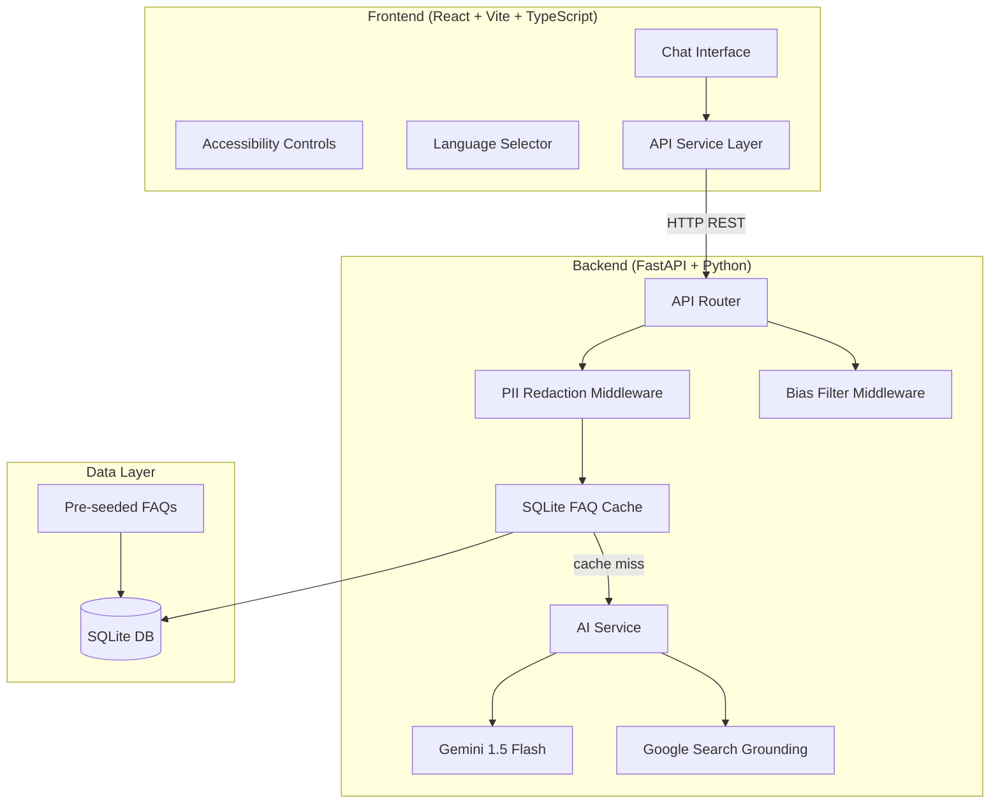

# VoteWise AI — Election Process Education Assistant

<p align="center">
  
</p>

An AI-powered conversational assistant that educates Indian citizens about the election process, built for the **PromptWars** competition.

## 🌟 Key Features

1. **Intent-Based Pillars**
   - **Registration & Eligibility:** Guides users through Forms 6/6A/8 and the Voter Portal.
   - **Candidate Information:** Real-time, unbiased factual data using Google Search Grounding.
   - **Process Education:** Interactive guides on EVMs, VVPATs, and finding polling booths.

2. **Security & Privacy**
   - **PII Redaction Middleware:** Uses REGEX and Verhoeff Checksum algorithms to intercept and redact Aadhaar, EPIC, PAN, phone numbers, and emails before sending data to the LLM. 
   - No user data is ever stored.

3. **Performance Efficiency**
   - **SQLite FAQ Cache:** Zero-dependency caching system for common questions to reduce API latency and Gemini token costs.

4. **Modern, Accessible UI**
   - **WCAG 2.1 Compliant:** Built-in font scaling (100%-200%), System-level High Contrast mode, and Reduced Motion support.
   - **Multi-language:** Supports English, Hindi, and Tamil natively.
   - **Responsive Design:** Premium dark-theme glassmorphism built with React and Vite.

5. **AI Integration**
   - **Google Gemini 1.5 Flash:** Used for rapid intent-aware responses.
   - **Google Search Grounding:** Enabled specifically for candidate queries to ensure factual real-time lookup.

## 🏗️ Architecture



## 🚀 How to Run

### Requirements
- Python 3.9+
- Node.js 18+

### 1. Setup Backend
```bash
cd backend
python -m venv venv
source venv/bin/activate
pip install -r requirements.txt

# Configure your environment variables
cp .env.example .env
# Edit .env and ADD YOUR GEMINI API KEY
# GEMINI_API_KEY=your-api-key

# Run the server
uvicorn app.main:app --reload --port 8000
```
Backend will be available at `http://localhost:8000`. API docs available at `http://localhost:8000/docs`.

### 2. Setup Frontend
```bash
cd frontend
npm install
npm run dev
```
Frontend will be available at `http://localhost:5173`.

## 🧪 Testing

The backend includes a comprehensive test suite (30 automated tests in PyTest) covering PII redaction, Bias filtration, SQLite Caching, Intent Classification, and API endpoints.

```bash
cd backend
source venv/bin/activate
export PYTHONPATH=.
pytest tests/ -v
```

## 🔐 Security Architecture

VoteWise AI implements a "Zero-Trust" data model for User Privacy:

1. Request enters `PIIRedactionMiddleware`.
2. The payload is checked against multi-pattern regexes.
3. For Aadhaar numbers, candidate numbers are run through a mathematical `Verhoeff checksum` to prevent false positives.
4. Detected PII is replaced with tokens (e.g. `[AADHAAR_REDACTED]`).
5. Only sanitized text reaches the caching and LLM layers.
6. A warning is surfaced back to the user informing them of the PII removal.

## 💡 Competition Criteria Mapping
- **Engineering & Implementation:** FastAPI backend + Vite/React frontend with modular Clean Architecture.
- **Problem Solving & Logic:** Complex multi-step processing (PII -> Cache -> Intent -> Grounding -> Bias Filter).
- **Efficiency:** Async HTTP layer + SQLite connection pooling + Result caching.
- **Accessibility:** Deep CSS integration for High Contrast, reduced motion, fluid typography.
- **Security:** Advanced PII redaction + API Rate limit architectural preparation.

---
*Built with ❤️ for PromptWars 2026*
